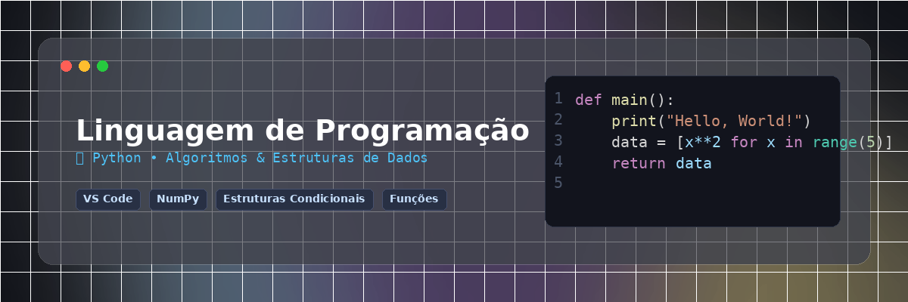

<p align="center">
  
</p>

# 🐍 Linguagem de Programação em Python

Repositório dedicado aos estudos, exercícios e projetos práticos desenvolvidos durante a disciplina de **Linguagem de Programação (Python)**.

Os algoritmos e códigos foram implementados utilizando o **Visual Studio Code** e testados em ambientes interativos como o **Google Colab**.

---

## 📌 Conteúdo do Repositório

### 📂 Unidade 1: Introdução à Linguagem Python

* **`U1_A1/` — Aula 1: A Linguagem Python**
  * `Nosso primeiro programa.py`: Introdução, sintaxe básica, uso da função `print()` e o clássico *"Hello World"*.
  * `Criando variaveis de tipos diferentes.py`: Declaração de variáveis, tipos primários (`int`, `str`, `float`, `bool`), função `type()` e interpolação com `f-strings`.
  * `Calculo de media.py`: Entrada de dados com `input()`, conversão de tipos e cálculo da média de notas.

* **`U1_A2/` — Aula 2: Estruturas Condicionais em Python**
  * `guardadoinformações.py`: Uso de operadores relacionais (`<`, `>`, `==`, `!=`) e lógicos (`and`, `or`, `not`). Aplicação de estruturas condicionais (`if`, `elif`, `else`) para tomada de decisão (ex: sistema de recomendação de cinema e verificação de idade/ingressos).

* **`U1_A3/` — Aula 3: Estruturas de Repetição em Python**
  * `Estruturas de repetição em Python.py`: Automatização de tarefas repetitivas usando laços `for` e `while`. Uso das funções de controle `range()`, `break` e `continue` (ex: sistema interativo de avaliação de filmes).

* **`U1_A4/` — Aula 4: Funções e Desconto de Loja**
  * `Loja.py`:
    * Utilização de funções *built-in* (`len()`, `sum()`, `round()`).
    * Criação de funções personalizadas pelo usuário (`def`) e funções anônimas (`lambda`).
    * **Projeto Prático / Estudo de Caso:** Calculadora de desconto para loja de eletrodomésticos, validando percentuais e calculando o preço final da compra.

---

### 📂 Unidade 2: Estruturas de Dados Avançadas

* **`U2_A1/` — Aula 1: Objetos Sequenciais, Mapeamentos e NumPy**
  * `aula1.py`: Manipulação de listas mutáveis, tuplas imutáveis, fatiamento (*slicing*) e *list comprehensions*.
  * `aula2.py`: Trabalho com conjuntos (`set`) para busca e eliminação de duplicadas, e dicionários (`dict`) para relacionamentos do tipo chave-valor.
  * `aula3.py`: Introdução à biblioteca **NumPy** (`ndarray`) para computação científica, matrizes multidimensionais e vetores.

---

## 🚀 Como Executar os Códigos

1. **Clone este repositório:**
   ```bash
   git clone [https://github.com/SEU-USUARIO/NOME-DO-REPOSITORIO.git](https://github.com/SEU-USUARIO/NOME-DO-REPOSITORIO.git)
